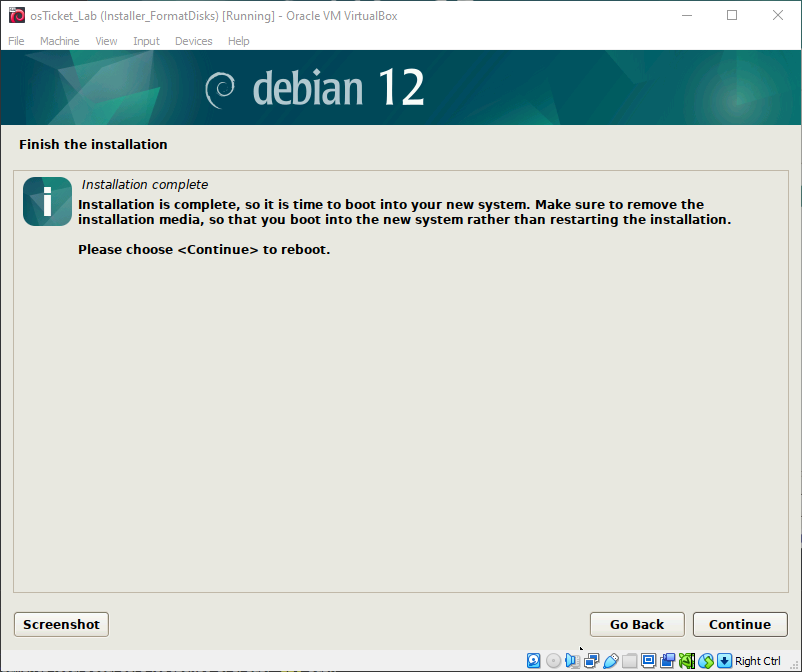

<h1>osTicket - Prerequisites and Installation</h1>
This tutorial outlines the prerequisites and installation of the open-source help desk ticketing system osTicket in a Linux environment. 

<!--
<h2>Video Demonstration</h2>

- ### [YouTube: How To Install osTicket with Prerequisites](https://www.youtube.com)
-->

<h2>Environments and Technologies Used</h2>

- Oracle VM VirtualBox
- Debian
- Apache
- SQL

<h2>Operating System Used </h2>

- Debian</b> 12.7.0

<h2>List of Prerequisites</h2>

- Debian `.iso` file
- CPU that supports Intel Virtualization Technology or AMD-V
- At least 2 GB of free RAM
- 25 GB storage space

<h2>Installation Steps</h2>

<h3>Part 1 - Installing Debian</h3>

We'll first need to download and install VirtualBox from [https://www.virtualbox.org/wiki/Downloads](https://www.virtualbox.org/wiki/Downloads). Once it is installed, we can head to [https://www.debian.org/](https://www.debian.org/) to download the latest version. Once the `.iso` file has finished downloading, we can go back to VirtualBox to configure a virtual machine running Debian. Click `New` to create a enter the setup wizard.

Give the VM a name of your choosing and make sure to select the Debian `.iso` file that we downloaded. For this tutorial, we will skip the unattended installation.

To find a balance between performance and hardware strain, we will allocate 2 GB of RAM and 2 CPU cores to the VM.

As Debian needs at least 10 GB of storage space to install the OS, we will allocate 20 GB of storage space for the VM.

Our virtual machine configuration should look something like this:

You should now see the VM in VirtualBox. Select the VM and click start to proceed to installing Debian.

For simplicity, we will choose to proceed with a graphical install.

Through the installation, feel free to use your language, location, and keyboard language. Now, when configuring the network, we'll stick with the default name.

Leave the domain field blank, as we will not be doing anything related to setting up a domain.

Proceed through the installer until you get to the partitioning disks step and select the first option.

Then select the virtual hard disk we created earlier to install Debian on.

When it asks how we want to partition our drive, stick the default partition.

Select `Yes` when it asks to format the disks.

When asked to install additional installation media, select `No`.

Proceed until the software installation screen, which we can leave as the default options. Note that we will be installing Apache web server later which is why we don't select to install the web server provided by Debian.

Select `Yes` when asked to install the GRUB boot loader.

Then select the partition that was created earlier in the installation.

Once this step has finished, you will be greeted with this screen indicating the installation has finished. Simply click on `Continue` to reboot the machine.

When the VM has restarted, log in to your account created during the installation wizard. Welcome to Debian!

