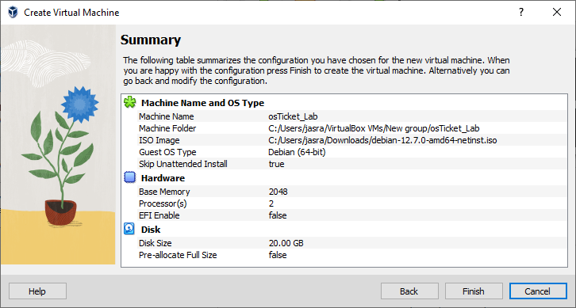
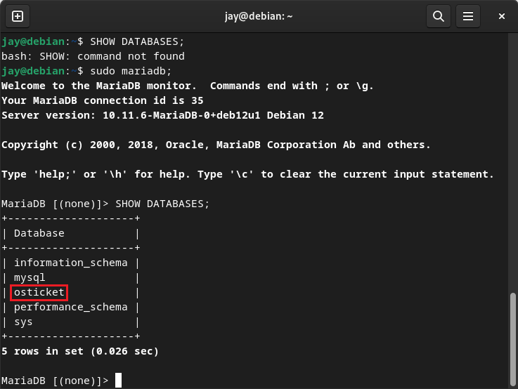

<p align="center">

</p>

<h1>osTicket - Prerequisites and Installation</h1>
This tutorial outlines the prerequisites and installation of the open-source help desk ticketing system osTicket in a Linux environment.<br />

<!--
<h2>Video Demonstration</h2>

- ### [YouTube: How To Install osTicket with Prerequisites](https://www.youtube.com)
-->

<h2>Environments and Technologies Used</h2>

- Oracle VM VirtualBox
- Debian
- Apache
- SQL
- MariaDB

<h2>Operating System Used </h2>

- Debian</b> 12.7.0

<h2>List of Prerequisites</h2>

- Debian `.iso` file
- CPU that supports Intel Virtualization Technology or AMD-V
- At least 2 GB of free RAM
- 20 GB storage space

<h2>Installation Steps</h2>

<h3>Part 1 - Installing Debian</h3>

We'll first need to download and install VirtualBox from [https://www.virtualbox.org/wiki/Downloads](https://www.virtualbox.org/wiki/Downloads). Once it is installed, we can head to [https://www.debian.org/](https://www.debian.org/) to download the latest version. Once the `.iso` file has finished downloading, we can go back to VirtualBox to configure a virtual machine running Debian. Click `New` to create a enter the setup wizard.


Give the VM a name of your choosing and make sure to select the Debian `.iso` file that we downloaded. For this tutorial, we will skip the unattended installation.


To find a balance between performance and hardware strain, we will allocate 2 GB of RAM and 2 CPU cores to the VM.


As Debian needs at least 10 GB of storage space to install the OS, we will allocate 20 GB of storage space for the VM.


Our virtual machine configuration should look something like this:



You should now see the VM in VirtualBox. Select the VM and click start to proceed to installing Debian.


For simplicity, we will choose to proceed with a graphical install.


Through the installation, feel free to use your language, location, and keyboard language. Now, when configuring the network, we'll stick with the default name.


Leave the domain field blank, as we will not be doing anything related to setting up a domain.


Proceed through the installer until you get to the partitioning disks step and select the first option.


Then select the virtual hard disk we created earlier to install Debian on.


When it asks how we want to partition our drive, stick the default partition.


Select `Yes` when it asks to format the disks.


When asked to install additional installation media, select `No`.


Proceed until the software installation screen, which we can leave as the default options. Note that we will be installing Apache web server later which is why we don't select to install the web server provided by Debian.


Select `Yes` when asked to install the GRUB boot loader.


Then select the partition that was created earlier in the installation.


Once this step has finished, you will be greeted with this screen indicating the installation has finished. Simply click on `Continue` to reboot the machine.


When the VM has restarted, log in to your account created during the installation wizard. Welcome to Debian!


<h3>Part 2 - Checking Updates</h3>

Before installing any applications, it is best practice to check for updates for packages. Note that if you created the root user during installation, our user account we logged in with won't have `sudo` permissions. To add ourselves to the list of `sudoers`, enter super user mode in the `Terminal` and enter the command `su`. Then navigate to `/etc`.


Then add your username to the file `sudoers`. Note that you may need to change file permissions to allow write access! The file should looks as follows:


We can now run with sudo permissions! Now, run `sudo apt update` to check for any upgrades. Then run `sudo apt upgrade` to upgrade the any outdated packages.

<h3>Part 3 - Installing Apache Web Server</h3>

To install Apache, run

`sudo apt install apache2`

Once installed, we can enable and start the apache web server

`sudo systemctl enable apache2`
`sudo systemctl start apache2`

To view the status of apache, we can run

`sudo systemctl status apache2`


For troubleshooting purposes, we can restart apache by running

`sudo systemctl restart apache2`

To shut off the apache web server, we can run

`sudo systemctl stop apache2`

With Apache installed, we can host osTicket and allow users to use the service through their web browser.

<h3>Part 4 - Installing MariaDB</h3>

We need a SQL database server to store information like user accounts, admin accounts, ticket information, etc. We can install MariaDB, as this is the most compatible version of the default MySQL database server that runs on Debian. To install MariaDB, run

`sudo apt install mariadb-server`

<h3>Part 4 - Installing PHP</h3>

PHP will be used to display content to the end-user and process requests to the database server. To install PHP and its necessary dependencies, we can run

`sudo apt install php libapache2-mod-php php-mysql`

To confirm that PHP was installed, run `php -v` to see the version of PHP. As of this tutorial, the latest version is 8.2.20.


<h3>Part 5 - Creating the Database</h3>

We can create the database from the command line. Type `sudo mariadb` to open the mariaDB interpreter and enter the following SQL commands:

```
CREATE DATABASE osticket;
GRANT ALL PRIVILEGES ON osticket.* TO osticket@localhost IDENTIFIED BY "Password1";
FLUSH PRIVILEGES;
```

To show all database schemas that exist, type `SHOW DATABASES;`. We can see our `osticket` database is present along with some other default created databases.



We have now created the database that will store all information related to osTicket. To exit the MariaDB command line interpreter, type `EXIT;`. We will revisit the MariaDB interpreter later once we actually install and configure osTicket.

<h3>Part 6 - Installing osTicket</h3>

First, we need to navigate to the root directory of the Apache web document located at `/var/www/html`. This directory is where webpage content lives so that Apache can fetch it and serve it to the client. It is here that we will install osTicket. Go to [https://osticket.com/download/](https://osticket.com/download/) and download the free version to get the zip file. When downloaded, move the zip file to `/var/www/html`. For convenience, I will do this in a separate tab.


As of this tutorial, the latest version of osTicket is **1.18.1**. Next, we go back to the `/var/www/html` directory and unzip the contents of the zip file by running

`sudo unzip osTicket-v1.18.1.zip -d osTicket`

This unzips the content into another folder called `osTicket`. Now that we have unzipped the zip file, we can delete it with the `rm` command. Next, navigate to to the directory `/var/www/html/osTicket/upload/include` and run

`sudo cp ost-sampleconfig.php ost-config.php `

This command copies the contents of the provided sample config file into a new file which we named `ost-config.php`.

To allow Apache the proper permissions to access web files, we need to change the ownership of all files in the `osTicket` folder. Apache uses the special user and group name of `www-data`. To change the ownership of all files and folders within the `osTicket` folder, run

`sudo chown -R www-data:www-data /var/www/html/osTicket/`

If you see the output `ls -l`, it should show the owners as `www-data`.


We also want to assign full rwx (read, write, execute) permissions to the 'www-data' user and group, while giving only rx (read and execute) permissions to everyone else. We can run
s
`sudo chmod -R 775 /var/www/html/osTicket/`

For a better understanding of Linux file permissions, see this guide: [https://www.stationx.net/linux-file-permissions-cheat-sheet/](https://www.stationx.net/linux-file-permissions-cheat-sheet/)


<h3>Part 7 - Configuring Apache</h3>

We now need to connect Apache so that it can talk to osTicket. We can accomplish this with a virtual host config file. Navigate to `/etc/apache2/sites-available` and run `sudo touch osticket.conf`. This will create a file with with the name `osticket.conf`. Then using your favorite command line text editor, paste the following code snippet into the config file:

```
<VirtualHost *:80>
ServerName osticket.helpdesk.com
DocumentRoot /var/www/html/osTicket/upload

<Directory /var/www/html/osTicket>
AllowOverride All
</Directory>

ErrorLog ${APACHE_LOG_DIR}/error.log
CustomLog ${APACHE_LOG_DIR}/access.log combined

</VirtualHost>
```

Notice that the `ServerName` is set to `osticket.helpdesk.com`. This is the domain name we set and will allow us to access the ticketing system through port 80 (HTTP). After saving the file, we then need to enable the virtual host by running

`sudo a2ensite rewrite`
`sudo a2ensite osticket.conf`

Reload Apache to finalize the changes.

`sudo systemctl reload apache2`
